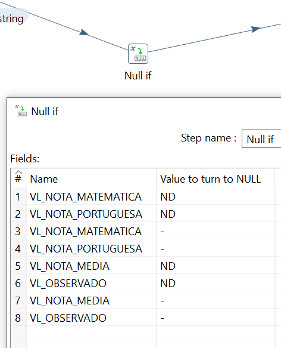

<h3> 
	<a name="Summary"><strong> Summary </strong></a>   	
<ul>
	
  
<li>
	<a href="#Null_if"> <i> Null if </i></a> 
</li>	
	
  
</ul>
</h3>	
	
--------------------------------------------------------------------------------------------------------------

<div>	
	<a name="Null_if"> <strong> &#129094 Null if </strong> </a>
	<p align="center">
   
  </p>
</div>	


# pentaho

```
Formula

if( [EMTI_CENSO] = 0; "0"; "1"), if [EMTI_CENSO] = 0 is 0, return 0, otherwise return 1

([NU_DURACAO_TURMA] + [NU_DUR_ATIV_COMP_MESMA_REDE] + [NU_DUR_ATIV_COMP_OUTRAS_REDES])/60
```
